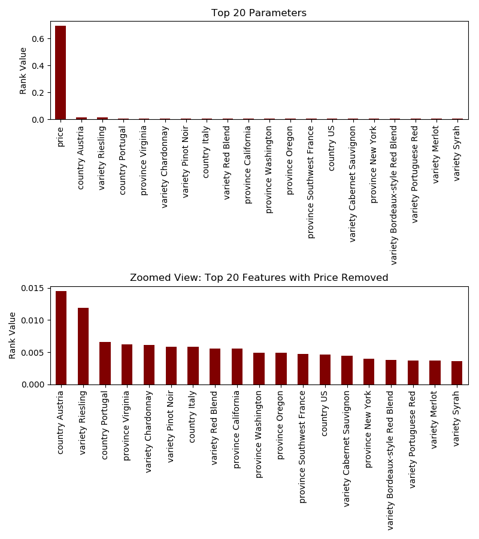

# Introduction

```"Wine is bottled poetry" -Robert Louis Stevenson```<sup>1</sup>

  According to The Wall Street Journal, WineEnthusiast Magazine is trying to become the "go-to company for *all* wine drinkers"<sup>2</sup>. True to form, the magazine has hundreds of thousands of reviews for all different kinds of bottles - from those you'd find in a fancy restaurant to those you might only find in a gas station - on their website. One kaggle user collected 130,000 reviews from the site in the hopes of encouraging others to build models that can identify wines based on the features WineEnthusiast provides (like price and country of origin).<sup>3<sup> 

  When we saw this dataset, we agreed with the poster that the data would be very useful in identifying wines based on their features. However, we were more intrigued by another question we could use this data to answer; namely, what makes a particular wine great? We decided to fit a model that would predict whether or not a given bottle will receive a high rating from WineEnthusiast and then use that model to understand which features were most important in determining quality. Can knowing a wine's price help determine it's quality? Or is it more helpful to know whether or not a given bottle is from Napa? We wanted to find out.

# Overview
  We are trying to answer the following question: What are the strongest three predictors that a consumer has access to that will indicate if a wine will receive a WineEnthusiast rating of 90 or greater?

  Why did we choose this exact question? Here, adapted from their website, is WineEnthusiast's rating scale (rating names and descriptions from WineEnthusiast):

| Number | Rating | Description |
|--------|----------|---------|
| 98–100 | Classic | The pinnacle of quality.|
| 94–97 | Superb | A great achievement.|
| 90–93 | Excellent | Highly recommended.|
| 87–89 | Very Good | Often good value; well recommended.|
| 83–86 | Good | Suitable for everyday consumption; often good value.|
| 80–82 | Acceptable | Can be employed in casual, less-critical circumstances.|

Table 1. Rating scale from WineEnthusiast. Products deemed Unacceptable (receiving a rating below 80 points) are not reviewed.<sup>4</sup>

We knew that we were going to use these ratings to determine what features make a wine particularly likely to be good. We originally were going to fit a model that would predict whether or not a wine was "Classic," but in the original dataset <.1% of wine was categorized as such, so we knew we would have a class imbalance problem. We considered fitting a model to predict whether a wine's rating would be above or below the median score in the dataset, which would ensure we would never have a class imbalance problem and would help us understand what makes a wine better or worse than average. However, we ultimately decided to predict whether or not a wine was greater than or equal to 90. This has the advantage of both mapping to WineEnthusiast's categorical ratings (the model will predict whether a wine was at least "Excellent"" or not) and also splitting the classes fairly evenly (~38% of wine in the original dataset had a rating >= 90).

# Data Cleaning and Feature Selection

So what is responsible for excellent wine? What features are important?

The dataset came with the following features (all of the information below is from the Github page of the Kaggle contributor):

> * Points: the number of points WineEnthusiast rated the wine on a scale of 1-100 (though they say they only post reviews for wines that score >=80)
  * Title: the title of the wine review, which often contains the vintage if you're interested in extracting that feature
* Variety: the type of grapes used to make the wine (ie Pinot Noir)
Description: a few sentences from a sommelier describing the wine's taste, smell, look, feel, etc.
* Country: the country that the wine is from
* Province: the province or state that the wine is from
* Region 1: the wine growing area in a province or state (ie Napa)
* Region 2: sometimes there are more specific regions specified within a wine growing area (ie Rutherford inside the Napa Valley), but this value can sometimes be blank
* Winery: the winery that made the wine
* Designation: the vineyard within the winery where the grapes that made the wine are from
* Price: the cost for a bottle of the wine
* Taster Name: name of the person who tasted and reviewed the wine
* Taster Twitter Handle: Twitter handle for the person who tasted ane reviewed the wine <sup>5</sup>

We ended up using only the following features to predict if a wine would be 90 points or greater:

* Variety
* Country
* Province
* Price

We removed the `Title` and `Description` columns because there were so many unique values in these columns relative to the size of the dataset that they wouldn't have been predictive.

We removed the `Taster Name`, `Taster Twitter Handle`, `Winery`, `Designation`, `Region 1`, and `Region 2` columns because we didn't think this would be information that would be accessible to the consumer. Also, for the region columns that information was already more or less captured in a more accessible way in the `country` and the `province` variables.

We also turned each categorical features into a series binary columns, one for each level of the feature. We did this because we were using a decision tree classifier, and its implementation in scikit-learn requires features to be turned into dummy variables.  

We got rid of any observations with NULL values, which wasn't a large proportion of the dataset (<7%).

Finally, we changed the `points` column (where the rating is stored) into a binary columnn that was `True` if the wine was given a rating of at least 90 ("Excellent") and `False` if it was given a rating lower than that. 

# Initial Data Exploration
  Before running our model, we explored our cleaned dataset to try to get a better sense of the data and anticipate what features would be important.

  When we pictured high-quality wine, the first things that popped in our head was that it was a fancy vineyard in a place like France or Italy. So we thought that the different country variables would be particularly important. Below is the proportion of "excellent" wines from the five countries with the most wine in our dataset.
  


Figure 1. 

  As we suspected, wine from France is more likely than average to be given a high-quality rating. Suprisingly, Italian wine is  worse than average. Note that the countries are ordered from left to right along the x-axis by how frequently they occur in the dataset. The US and France make a lot of wine, and they've clearly figured out how to do it well.

  The other big factor that we suspected would correlate with wine quality was price. After all, you've probably never drank wine out of a bag or a box that you would classify as "excellent." Below we have boxplots of price for wines that were and weren't given a rating greater than or equal to 90:


Figure 2. 

  As expected, the price of the higher-quality bottles is much higher than the price of the lower-quality ones. It is interesting that while lower-quality wine is almost always cheap, higher-quality wine has a much wider range of potential prices. While there are outlier bottles that are thousands of dollars, 25% of the good stuff is under $40. This led us to the question: if you find a cheap bottle of wine that WineEnthusiast has rated, is there a good chance its well-reviewed?

Below we have a histogram for all wine cheaper than $100, again segemented by rating:


Figure 3. 

  As you can see, if you select a random bottle of cheap wine, particularly one under \$40, its very unlikely that it will be a high-quality one. Even though there is a good deal of cheap, high-quality wine, because almost all of the lower-quality wine is in that area between \$10 and \$40, lower-quality wine represents the vast majority of bottles in that price range.

  What about wine variety? Below we have the five varieties that appear most often in our dataset and what proportion of each were well-reviewed:
  


Figure 4. 

Pinot Noir fairs particularly well here.

While we were able to glean a lot of interesting information from plotting our data, we needed a model to definitively determine what features would be most useful in predicting if a wine is high-quality.

# Model 

The type of model chosen for this analysis was a decision tree and DecisionTreeClassifier from scikit-learn <sup>6</sup> was used. The model was choosen because it can handle continous and categorical data, the data set had input and output pairs, the amount of data was less than 100k and the researchers have experience using this model. The parameters being evaluated were price, country, province and variety. Country was split up to each of the countries within the category, the same was done for provience and variety. In total there are 1156 parameters being analzyed in this analysis. The training of the model was run on 80% of our data and then tested occured on the remaining 20% of the data set. The max depth of the model was chosen based on the maximum testing accuacy between depth 2 and 50. 


Figure 5. Plot of the test accuracy from depth 2 to depth 50


The decision tree was to large to print the entire tree to screen, here is a view of depth 3. It seems resonable that the split at the root is when price <= 30.5 which relates back to figure 3, where there is a visible difference in the distributions of the groups around 30. 


Figure 6. Decision tree at depth 3

# Conclusion 

There were 1156 parameters analzyed in the analysis and the top 20 have been plotted to make the analysis of results resonable.The parameter were ranked based on Gini Importance, a feature will be ranked higher if the results of the split are more homogeneous. Price is the highest ranked parameter with a feature importance value of 0.7569, the next highest ranked parameter is the country Austria with a value of 0.0165. There is a huge difference in the values between the top ranked predictor and the second best predictor. The third best predictor is the grape variety Riesling with a feature value of 0.0135. There is less of a difference between the second and third predictor.These top 3 predictors are much stronger then the rest of the predictors shown in figure 7. All of the top 3 predictors appear in figure 6, which means they appear within depth 3 of the decision tree. 


| Parameter | Feature  Value |
| --------- | -------------- |
| price |	0.7569 |
| country_Austria |	0.0165 |
| variety_Riesling |	0.0135 |

Table 2. Top 3 Predictors




Figure 7. Plot of the top 20 predictors and a zoomed in view of the top predictors with price removed.

# Limitations
- The dataset we used contains roughly half of all WineEnthusiast reviews (130k/260k) as of 11/23/2018 (https://www.winemag.com/?s=&drink_type=wine), ideally we'd train our model on the whole dataset. This dataset was pulled a year ago (11/2017) and might be due for an update.
- WineEnthusiast magazine only rates wine that it views as very good (80+), so our model and conclusions do not generalize to all wines. 

# Next Steps/Extensions
- We'd like to be able to train a model that would measure quality *depending on an individual's taste*
- We'd like to be able tell a more causal story (e.g. "this bottle is better because it was grown in France"). Thats hard to do with the given dataset, we can only see if the factors correlate with the outcome.

---
### References
<sub> 1 Robert Louis Stevenson Quotes. (n.d.). BrainyQuote.com. Retrieved November 22, 2018, from BrainyQuote.com Web site: https://www.brainyquote.com/quotes/robert_louis_stevenson_155195</sub>

<sub> 2 Covel, Simona. “Wine Enthusiast Looks to Win Over a Wider Audience.” The Wall Street Journal, Dow Jones & Company, 3 Oct. 2008, www.wsj.com/articles/SB122290564075496371.</sub>

<sub> 3 Thoutt, Z. (2017, November). Wine Reviews, Version 4. Retrieved November 15, 2018 from https://www.kaggle.com/zynicide/wine-reviews </sub>

<sub> 4 “The Wine Enthusiast Buying Guide.” WineEnthusiast www.winemag.com, Retrieved November 15, 2018 from www.winemag.com/wp-content/uploads/PDFs/Tasting/AboutTheBuyingGuide.pdf.</sub>

<sub> 5 Thoutt, Z. (2017, November). Wine Deep Learning. Retrieved November 15, 2018 from https://github.com/zackthoutt/wine-deep-learning </sub>

<sub> 6
@article{scikit-learn,
 title={Scikit-learn: Machine Learning in {P}ython},
 author={Pedregosa, F. and Varoquaux, G. and Gramfort, A. and Michel, V.
         and Thirion, B. and Grisel, O. and Blondel, M. and Prettenhofer, P.
         and Weiss, R. and Dubourg, V. and Vanderplas, J. and Passos, A. and
         Cournapeau, D. and Brucher, M. and Perrot, M. and Duchesnay, E.},
 journal={Journal of Machine Learning Research},
 volume={12},
 pages={2825--2830},
 year={2011}
}
</sub>

