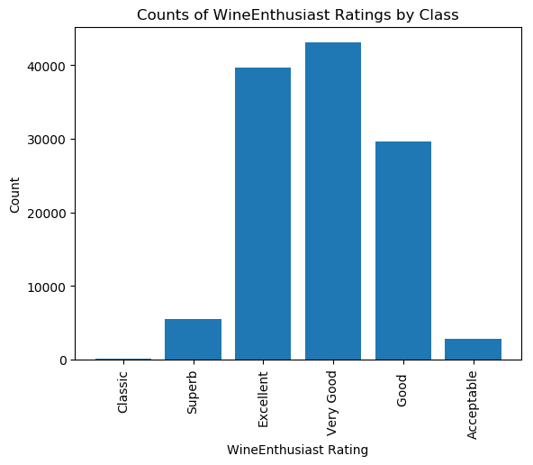
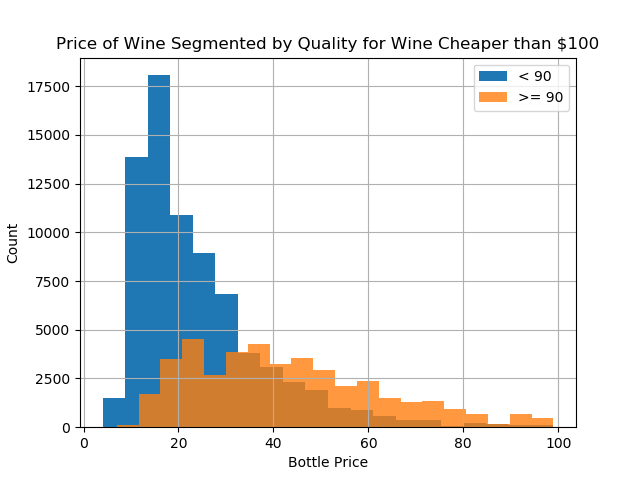
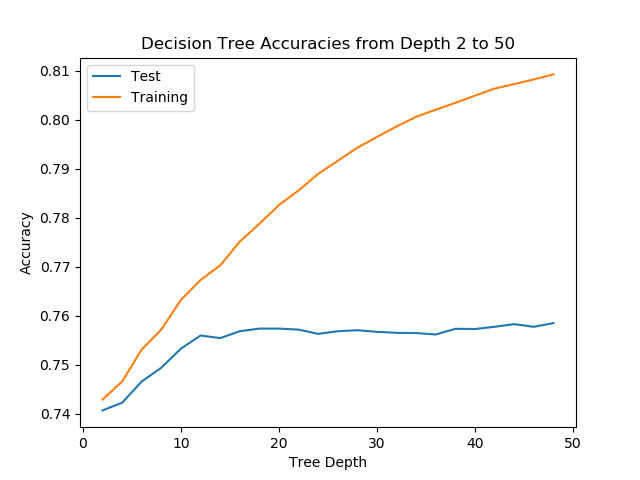
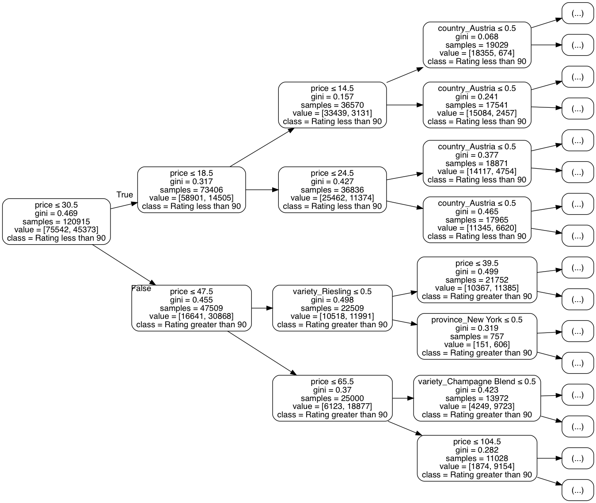

Parameters for Predicting WineEnthusiast Ratings
================
Ayla Pearson and Richie Zitomer
November 23, 2018

Introduction
============

`"Wine is bottled poetry" -Robert Louis Stevenson`1

According to The Wall Street Journal, WineEnthusiast Magazine is trying to become the "go-to company for *all* wine drinkers"2. True to form, the magazine has hundreds of thousands of reviews for all different kinds of bottles - from those you'd find in a fancy restaurant to those you might only find in a gas station - on their website. One kaggle user collected 130,000 reviews from the site in the hopes of encouraging others to build models that can identify wines based on the features WineEnthusiast provides (like price and country of origin).3

When we saw this dataset, we agreed with the poster that the data would be very useful in identifying wines based on their features. However, we were more intrigued by another question we could use this data to answer; namely, what makes a particular wine great? We decided to fit a model that would predict whether or not a given bottle will receive a high rating from WineEnthusiast and then use that model to understand which features were most important in determining quality. Can knowing a wine's price help determine it's quality? Or is it more helpful to know whether or not a given bottle is from Napa? We wanted to find out.

Overview
========

We are trying to answer the following question: What are the strongest three predictors that a consumer has access to that will indicate if a wine will receive a WineEnthusiast rating of 90 or greater?

Why did we choose this exact question? Here, adapted from their website, is WineEnthusiast's rating scale (rating names and descriptions from WineEnthusiast):

| Number | Rating     | Description                                             |
|--------|------------|---------------------------------------------------------|
| 98-100 | Classic    | The pinnacle of quality.                                |
| 94-97  | Superb     | A great achievement.                                    |
| 90-93  | Excellent  | Highly recommended.                                     |
| 87-89  | Very Good  | Often good value; well recommended.                     |
| 83-86  | Good       | Suitable for everyday consumption; often good value.    |
| 80-82  | Acceptable | Can be employed in casual, less-critical circumstances. |

Table 1. Rating scale from WineEnthusiast. Products deemed Unacceptable (receiving a rating below 80 points) are not reviewed.4

We knew that we were going to use these ratings to determine what features make a wine particularly likely to be good. We originally were going to fit a model that would predict whether or not a wine was "Classic," but in the original dataset &lt;.1% of wine was categorized as such, so we knew we would have a class imbalance problem. We considered fitting a model to predict whether a wine's rating would be above or below the median score in the dataset, which would ensure we would never have a class imbalance problem and would help us understand what makes a wine better or worse than average. However, we ultimately decided to predict whether or not a wine was greater than or equal to 90. This has the advantage of both mapping to WineEnthusiast's categorical ratings (the model will predict whether a wine was at least "Excellent"" or not) and also splitting the classes fairly evenly (~38% of wine in the original dataset had a rating &gt;= 90).

Figure 1. The frequencies of each of the categorical wine ratings in our dataset.

As you can see above, the classes are fairly uneven (WineEnthusiast rarely gives a rating of 'Classic' or'Acceptable').

Data Cleaning and Feature Selection
===================================

So what is responsible for excellent wine? What features are important?

The dataset came with the following features (all of the information below is from the Github page of the Kaggle contributor):

> -   Points: the number of points WineEnthusiast rated the wine on a scale of 1-100 (though they say they only post reviews for wines that score &gt;=80)
> -   Title: the title of the wine review, which often contains the vintage if you're interested in extracting that feature
> -   Variety: the type of grapes used to make the wine (ie Pinot Noir)
> -   Description: a few sentences from a sommelier describing the wine's taste, smell, look, feel, etc.
> -   Country: the country that the wine is from
> -   Province: the province or state that the wine is from
> -   Region 1: the wine growing area in a province or state (ie Napa)
> -   Region 2: sometimes there are more specific regions specified within a wine growing area (ie Rutherford inside the Napa Valley), but this value can sometimes be blank
> -   Winery: the winery that made the wine
> -   Designation: the vineyard within the winery where the grapes that made the wine are from
> -   Price: the cost for a bottle of the wine
> -   Taster Name: name of the person who tasted and reviewed the wine
> -   Taster Twitter Handle: Twitter handle for the person who tasted ane reviewed the wine 5

We ended up using only the following features to predict if a wine would be 90 points or greater:

-   Variety
-   Country
-   Province
-   Price

### Summary Statistics of Important Variables

Note that the summary statistics shown are different for categorical and numerical variables. Note that this is based on 129,971 observations.

#### Variety

| Statistic                 | Value      |
|---------------------------|------------|
| Unique Values             | 707        |
| Most Frequent Value       | Pinot Noir |
| Count of Most Freq. Value | 13,272     |

#### Country

| Statistic                 | Value  |
|---------------------------|--------|
| Unique Values             | 43     |
| Most Frequent Value       | US     |
| Count of Most Freq. Value | 54,504 |

#### Province

| Statistic                 | Value      |
|---------------------------|------------|
| Unique Values             | 425        |
| Most Frequent Value       | California |
| Count of Most Freq. Value | 36,247     |

#### Price

| Statistic     | Value |
|---------------|-------|
| Mean          | 35.36 |
| Standard Dev. | 41.02 |
| Min           | 4     |
| Median        | 25    |
| Max           | 3,300 |

### Data Cleaning

We removed the `Title` and `Description` columns because there were so many unique values in these columns relative to the size of the dataset that they wouldn't have been predictive.

We removed the `Taster Name`, `Taster Twitter Handle`, `Winery`, `Designation`, `Region 1`, and `Region 2` columns because we didn't think this would be information that would be accessible to the consumer. Also, for the region columns that information was already more or less captured in a more accessible way in the `country` and the `province` variables.

We also turned each categorical features into a series binary columns, one for each level of the feature. We did this because we were using a decision tree classifier, and its implementation in scikit-learn6 requires features to be turned into dummy variables.

We got rid of any observations with NULL values, which wasn't a large proportion of the dataset (&lt;7%).

Finally, we changed the `points` column (where the rating is stored) into a binary columnn that was `True` if the wine was given a rating of at least 90 ("Excellent") and `False` if it was given a rating lower than that.

Initial Data Exploration
========================

Before running our model, we explored our cleaned dataset to try to get a better sense of the data and anticipate what features would be important.

When we pictured high-quality wine, the first things that popped in our head was that it was a fancy vineyard in a place like France or Italy. So we thought that the different country variables would be particularly important. Below is the proportion of "excellent" wines from the five countries with the most wine in our dataset.

Figure 2. Wine Quality by Country. Bar width represents the number of wines from that country in the dataset relative to the US.

As we suspected, wine from France is more likely than average to be given a high-quality rating. Suprisingly, Italian wine is worse than average. Note that the countries are ordered from left to right along the x-axis by how frequently they occur in the dataset. The US and France make more wine than any other country, and they've clearly figured out how to do it well.

The other big factor that we suspected would correlate with wine quality was price. After all, you've probably never drank wine out of a bag or a box that you would classify as "excellent." Below we have boxplots of price for wines that were and weren't given a rating greater than or equal to 90:

Figure 3. Boxplot of Wine Price Segmented by Quality

As expected, the average price of the higher-quality bottles is much higher than the average price of the lower-quality ones. It is interesting that, while lower-quality wine is almost always cheap, higher-quality wine has a much wider range of potential prices. While there are outlier bottles that are thousands of dollars, 25% of the good stuff is under $40. This led us to the question: if you find a cheap bottle of wine that WineEnthusiast has rated, is there a good chance its well-reviewed?

Below we have a histogram for all wine cheaper than $100, again segemented by rating:

Figure 4. Histogram of Cheaper Wine Prices Segmented by Quality

As you can see, if you select a random bottle of cheap wine, particularly one under $40, its very unlikely that it will be a high-quality one. Even though there is a good deal of cheap, high-quality wine, because almost all of the lower-quality wine costs between $10 and $40, lower-quality wine represents the vast majority of bottles in that price range.

What about wine variety? Below we have the five varieties that appear most often in our dataset and what proportion of each were well-reviewed:

Figure 5. Wine Quality by Variety. Bar width represents the number of wines of that variety in the dataset relative to Pinot Noir.

Pinot Noir fairs particularly well here.

While we were able to glean a lot of interesting information from plotting our data, we needed a model to definitively determine what features would be most useful in predicting if a wine is high-quality.

Model
=====

The model used was a decision tree and the software was the DecisionTreeClassifier module from scikit-learn 6. The model was chosen because it can handle continuous and categorical data, the data had input and output pairs, the amount of data was less than 100k samples6 and the researchers have experience using this model. The training of the model was run on 80% of our data and then tested on the remaining 20%. The max depth of the model is chosen by automatically getting the maximum testing accuracy between depth 2 and 50. The max depth of the model was the only hyperparameter adjusted. The maximum testing accuracy of the model is 76%. The final model was run with the complete data set and thus could not be tested so there is no final accuracy score provided for the model.

Figure 6. Results of the test accuracy ranging from depth 2 to 50. Max value depth was chosen as the hyperparameter for the model.

To visualize the decision tree an image of depth 3 was generated. The decision tree is too large to print the entire model to an image, so depth 3 was choose as an optimal size. Depth 4 was too large to fit within the report and depth 2 only has feature splits on price.

Figure 7. Decision tree at depth 3

Conclusion
==========

There were 1156 features analyzed in the analysis and the top 20 ranked features are show in figure 7. The features were ranked based on Gini Importance, a feature will be ranked higher if the classes of the split are more homogeneous. Price is the highest ranked parameter with a feature importance value of 0.7569, the next highest ranked feature is the country Austria with a value of 0.0165. The third best predictor is the grape variety Riesling with a feature value of 0.0135. There is a huge difference in the values between the top ranked feature and the second-best feature and less of a difference between the second and third predictor. The top three predictors are much stronger then the rest of the predictors shown in figure 7. All of the top three predictors appear in figure 6, which means they at least appear within depth 3 of the decision tree.

The feature ranking tells us the level of importance that the feature has within the model but does not tell us how the feature effects the model. For example, the feature of country Austria is on this list, but without further exploartion we don't know if being from Australia means a wine is more or less likely to receive an excellent rating. The same can be said about the variety Riesling. A further analysis on these individual features would help to answer how they effect the model. In many cases, we can pair feature importance with our exploratory analysis to see the direction of these splits; in particular, if the split at the root of the tree - price &lt;= 30.5 - is True then the wine is much more likely to be categorized lower quality. As you can see from figure 3, the majority of the distribution for wine with a rating less than 90 points is between 0 and 30 dollars. Around this point there appears to be a clear splitting point between the two outcome categories, and this is borne out by our model.

Based on our analysis the best feature in determining the quality of wine is price. This feature was ranked much higher than the rest of the features. Unfortunately, with this analysis we can not make direct statements like if you buy a wine from Austria it will be excellent, but with the exploratory analysis (figure 2 and figure 3) and decision tree (figure 6) it is reasonable to say if you buy a bottle of wine over $30.50 it has a better chance of being of excellent quality.

Figure 7. Plot of the top 20 features and a zoomed in view of the top features with price removed.

| Feature          | Feature Ranking Value |
|------------------|-----------------------|
| price            | 0.7569                |
| Country Austria  | 0.0165                |
| Variety Riesling | 0.0135                |

Table 2. Top three ranked features

Limitations
===========

-   The dataset we used contains roughly half of all WineEnthusiast reviews (130k/260k) as of 11/23/2018 (<https://www.winemag.com/?s>=&drink\_type=wine), ideally we'd train our model on the whole dataset. This dataset was pulled a year ago (11/2017) and might be due for an update.
-   WineEnthusiast magazine only rates wine that it views as very good (80+), so our model and conclusions do not generalize to all wines.

Next Steps/Extensions
=====================

-   We'd like to be able to train a model that would measure quality *depending on an individual's taste*
-   We'd like to be able tell a more causal story (e.g. "this bottle is better because it was grown in France"). Thats hard to do with the given dataset, we can only see if the factors correlate with the outcome. Potentially a regression analysis on the top features would help to determine if the feature has a positive or negative correlation.

------------------------------------------------------------------------

### References

 1 Robert Louis Stevenson Quotes. (n.d.). BrainyQuote.com. Retrieved November 22, 2018, from BrainyQuote.com Web site: <https://www.brainyquote.com/quotes/robert_louis_stevenson_155195>

 2 Covel, Simona. Wine Enthusiast Looks to Win Over a Wider Audience. The Wall Street Journal, Dow Jones & Company, 3 Oct. 2008, www.wsj.com/articles/SB122290564075496371.

 3 Thoutt, Z. (2017, November). Wine Reviews, Version 4. Retrieved November 15, 2018 from <https://www.kaggle.com/zynicide/wine-reviews> 

 4 The Wine Enthusiast Buying Guide. WineEnthusiast www.winemag.com, Retrieved November 15, 2018 from www.winemag.com/wp-content/uploads/PDFs/Tasting/AboutTheBuyingGuide.pdf.

 5 Thoutt, Z. (2017, November). Wine Deep Learning. Retrieved November 15, 2018 from <https://github.com/zackthoutt/wine-deep-learning> 

 6 @article{scikit-learn, title={Scikit-learn: Machine Learning in {P}ython}, author={Pedregosa, F. and Varoquaux, G. and Gramfort, A. and Michel, V. and Thirion, B. and Grisel, O. and Blondel, M. and Prettenhofer, P. and Weiss, R. and Dubourg, V. and Vanderplas, J. and Passos, A. and Cournapeau, D. and Brucher, M. and Perrot, M. and Duchesnay, E.}, journal={Journal of Machine Learning Research}, volume={12}, pages={2825--2830}, year={2011} } <https://scikit-learn.org/stable/index.html> 
