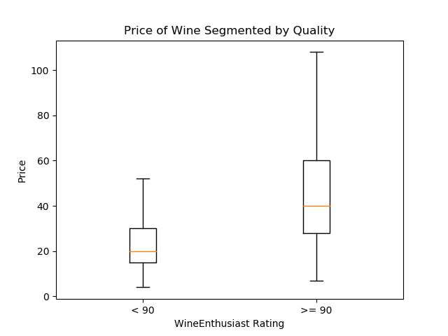

# Introduction

```Wine is bottled poetry -Robert Louis Stevenson```<sup>1</sup>

Every year, WineEnthusiast Magazine reviews thousands of wines...

| Number | Rating | Description |
|--------|----------|---------|
| 98–100 | Classic | The pinnacle of quality.|
| 94–97 | Superb | A great achievement.|
| 90–93 | Excellent | Highly recommended.|
| 87–89 | Very Good | Often good value; well recommended.|
| 83–86 | Good | Suitable for everyday consumption; often good value.|
| 80–82 | Acceptable | Can be employed in casual, less-critical circumstances.|

Products deemed Unacceptable (receiving a rating below 80 points) are not reviewed.

# Overview
What are the strongest three predictors to indicate if a wine will recieve a WineEnthusiast above 90?

# Initial Exploration





# Model

# Conclusion


---
### References
<sub>1 Robert Louis Stevenson Quotes. (n.d.). BrainyQuote.com. Retrieved November 22, 2018, from BrainyQuote.com Web site: https://www.brainyquote.com/quotes/robert_louis_stevenson_155195</sub>

<sub>2 Adapted from 'About the Scores' section of WineEnthusiast https://www.winemag.com/buying-guide/patland-2013-stagecoach-vineyard-select-barrel-reserve-cabernet-sauvignon-napa-valley/ </sub>