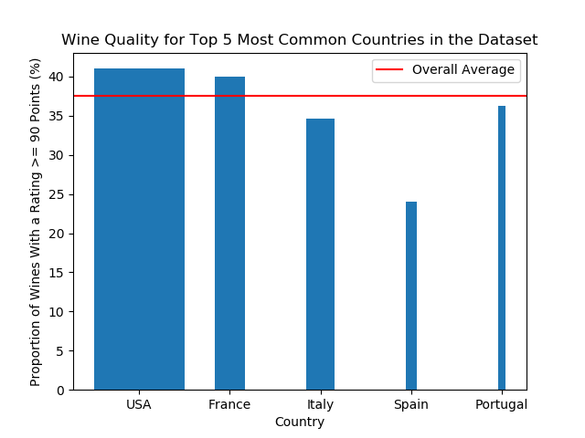

Parameters for Predicting WineEnthusiast Ratings
================
Ayla Pearson and Richie Zitomer
November 23, 2018

Introduction
============

`Wine is bottled poetry -Robert Louis Stevenson`1

Every year, WineEnthusiast Magazine reviews thousands of wines...

| Number | Rating     | Description                                             |
|--------|------------|---------------------------------------------------------|
| 98–100 | Classic    | The pinnacle of quality.                                |
| 94–97  | Superb     | A great achievement.                                    |
| 90–93  | Excellent  | Highly recommended.                                     |
| 87–89  | Very Good  | Often good value; well recommended.                     |
| 83–86  | Good       | Suitable for everyday consumption; often good value.    |
| 80–82  | Acceptable | Can be employed in casual, less-critical circumstances. |

Products deemed Unacceptable (receiving a rating below 80 points) are not reviewed.

We wanted to use these ratings to determine what features make a wine particularly likely to be good. We originally were going to fit a model that would predict whether or not a wine was "Classic," but in the original dataset &lt;.1% of wine was categorized as such, so we knew we would have a class imbalance problem. We considered fitting a model to predict whether a wine's rating would be above or below the median score in the dataset, which would ensure we would never have a class imbalance problem and would help us understand what makes a wine better or worse than average. Ultimiately, we decided to predict whether or not a wine was greater than or equal to 90. This has the advantage of both mapping to WineEnthusiast's categorical ratings (the model will predict whether a wine was at least "Excellent"" or not) and it also splits the classes fairly evenly (~38% of wine in the original dataset had a rating &gt;= 90).

Overview
========

What are the strongest three predictors that a consumer has access to that will indicate if a wine will receive a WineEnthusiast rating of 90 or greater?

Initial Exploration
===================

Model
=====

Conclusion
==========

------------------------------------------------------------------------

### References

1 Robert Louis Stevenson Quotes. (n.d.). BrainyQuote.com. Retrieved November 22, 2018, from BrainyQuote.com Web site: <https://www.brainyquote.com/quotes/robert_louis_stevenson_155195>

2 Adapted from 'About the Scores' section of WineEnthusiast <https://www.winemag.com/buying-guide/patland-2013-stagecoach-vineyard-select-barrel-reserve-cabernet-sauvignon-napa-valley/> 
